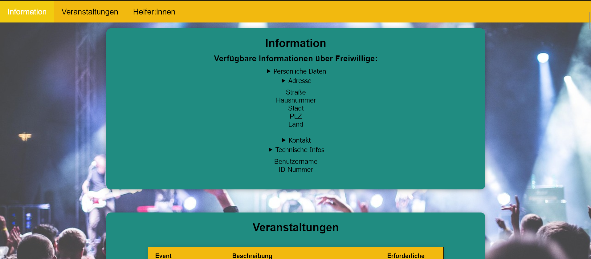
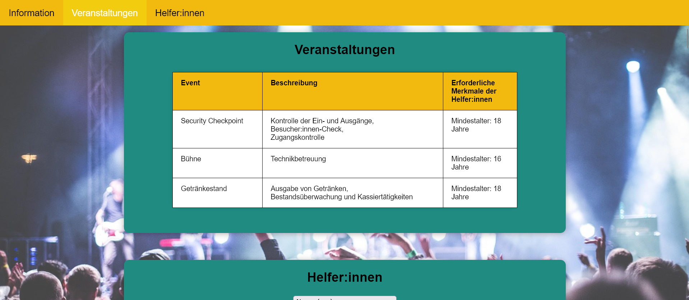
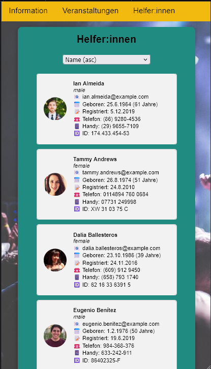

# T02 Single-Page-Application for Festival Organization (Web Technologies)

### Project Preview

  
  
  

## Context
This project was developed as the second milestone within the "Web Technologies" module at my university. The objective was to transition from static web pages to a dynamic Single-Page-Application (SPA). The focus was on implementing client-side logic using JavaScript, handling API requests (fetching data), and manipulating the DOM to create an interactive user experience.

## Description
The website is a simple web application that aims to help with the organization of the festival "Rock am See". A countdown at the top displays the time remaining until the festival starts. Three further sections present information, events, and a list of volunteers who have registered for specific events. Via a dropdown menu, the volunteer list can be dynamically sorted by name or registration date in ascending or descending order. A fixed navigation bar allows quick access to all sections. During the data retrieval process, a three-dot animation signals the loading status.

## Folder Structure
- home.html
- script.js
- style.css
- festival.jpg
- README.md

## How to Start/Use the Website
1. Download the folder.
2. If needed, unzip the folder.
3. Open the folder and double-click home.html to open it in your browser. (If it doesn't open, right-click > "Open with" > select your browser).
4. Navigate through the page via scrolling or by using the navigation bar.
5. Enjoy! 😊

## Used Resources
- API: https://randomuser.me/api/?results=30&seed=a
- Code Sandbox: https://codesandbox.io/p/sandbox/luoos 
- Documentation of Date() Constructor: https://developer.mozilla.org/en-US/docs/Web/JavaScript/Reference/Global_Objects/Date/Date

## Testing
The application was tested on Brave Browser, Firefox, and Chrome.
